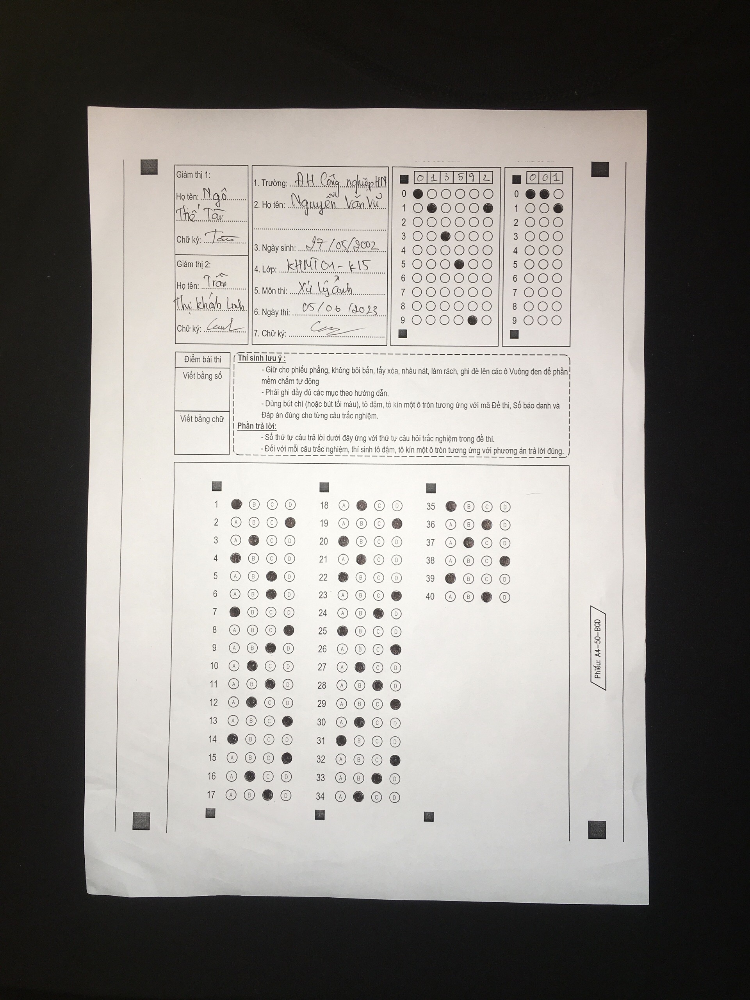

# autograde

# Dataset

vn: Bộ dữ liệu được lấy từ [Phần mềm chấm thi trắc nghiệm](https://www.chamthi.com/huongdan)

en: The dataset is obtained from [Multiple choice exam marking software](https://www.chamthi.com/huongdan)

# Knowledge

vn: kiến thức sử dụng trong dự án này là dùng kĩ thuật xử lý ảnh thuần

- adaptive threshold: Ngưỡng tự động -> chia nhỏ ảnh thành các block

- bilateralFilter   : Lọc song phương -> làm mờ các pixel có cường độ tương tụ trong một vùng lân cận

# Result

- Thresholding result [05/06/2023]:

  <h2> 
   
   
       
  </h2>

# References

[1](https://www.phamduytung.com/blog/2020-12-24-thresholding/) Thresholding

[2](https://aiots.vn/phan-9-loc-anh-su-dung-tich-chap-trong-opencv/#9) bilateralFilter